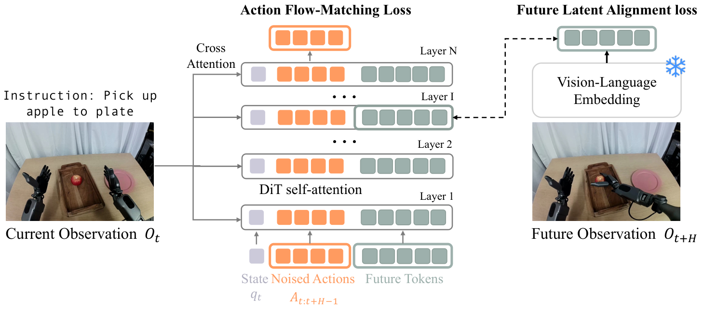

# FLARE Reading Notes

- Paper: **FLARE: Robot Learning with Implicit World Modeling**
- Original: [PDF](https://arxiv.org/pdf/2505.15659) · [arXiv v1, 2025-05-21](https://arxiv.org/html/2505.15659v1)
- Reading started: 2026-09-29

## 1. Problem and Main Contributions

**Can a robot policy benefit from predicting the future without reconstructing future images?**

FLARE (**Future LAtent REpresentation Alignment**) supervises an action model with compact representations of recorded future observations. The aim is to make future prediction useful for control while avoiding the cost of detailed image generation.

The introduction presents three connected contributions:

1. **Future representation alignment.** Add learnable future tokens to an action DiT and align their intermediate features with future-observation embeddings, alongside action flow matching.
2. **Action-aware targets.** First train an observation encoder through action prediction, so its compact embeddings capture information useful for control. These embeddings become the future prediction targets.
3. **Learning from videos without action labels.** Human videos can supply future alignment supervision, while robot demonstrations supply both action and alignment supervision.

The authors report improved manipulation performance in simulation and on a real robot. Our reading is that this supports future-feature supervision under the tested conditions; it does not establish that reconstructing video is never useful. [Introduction and project overview](https://research.nvidia.com/labs/gear/flare/)

## 2. Architecture, Training, and Inference

### 2.1 Figure 2: how to read the architecture



*Figure 2 from [FLARE, arXiv v1](https://arxiv.org/html/2505.15659v1#S3.F2). Original authors' figure; the explanation below summarizes our discussion. The drawn token counts are schematic.*

Read the figure along four paths:

1. **Left: current observation and instruction.** SigLIP2, fusion layers, and a Q-former produce 32 observation embeddings. These supply the **keys and values** for DiT cross-attention. The figure abstracts this encoding pipeline into the left-hand conditioning arrows.
2. **Bottom to top: the DiT sequence.** Purple denotes the state token, orange the noised action tokens, and green the learnable future tokens. Self-attention lets all three groups exchange information. Their hidden states also supply the **queries** that read current observation embeddings through cross-attention.
3. **Top: action output.** Features at the action-token positions pass through an action head to predict the flow-matching velocity. Updating the noisy action chunk with this velocity is one sampling step. The 32 observation embeddings are conditioning features; they are not directly decoded into actions.
4. **Right: future supervision.** A recorded future observation is encoded into target embeddings. Projected future-token features from an intermediate DiT layer are aligned with these targets using cosine similarity. The dashed path represents supervision, not future-observation input to the DiT. The snowflake indicates stopped gradients through the target encoder; EMA can still update its parameters.

### 2.2 SigLIP2 and DiT have different roles

**SigLIP2 is the perception encoder; DiT is the action-generation network.** DiT means Diffusion Transformer: a Transformer used in iterative generative modeling. In FLARE, it is trained with action flow matching. The final action head is a two-layer MLP; unlike DiT attention layers, that head has no Q/K/V.

The observation encoder uses `siglip2-large-patch16-256`, followed by four vision-language fusion layers and a Q-former. For a single image, the image encoder produces 256 patch tokens and the text encoder produces 32 padded text tokens. Q-former queries compress the fused sequence into 32 observation tokens. Multi-camera input still produces a fixed-size output. **There is no VAE in this target construction.** [§3.2 and Appendix A](https://arxiv.org/html/2505.15659v1#A1)

### 2.3 Three different sets of 32 tokens

| Tokens | Origin | Role |
|---|---|---|
| Current observation embeddings | Current image(s) and instruction through the policy encoder | DiT cross-attention K/V |
| Future observation embeddings | Recorded future image(s) and instruction through the target encoder | Alignment targets; no gradient through this branch |
| DiT future tokens | A separate set of learnable input vectors | Predictive hidden states that interact with action/state tokens |

**Q-former's learnable queries and DiT's learnable future tokens are different parameters.** The former extract observation features; the latter learn to predict future features inside the action model. Q-former outputs affect DiT hidden states through attention, rather than copying or directly updating its future-token parameters.

At the input, the same learned future-token vectors are reused across samples. After attention, their hidden states depend on the sample's observation, state, and noisy actions. They are neither actions nor ground-truth future embeddings fed into the policy. Their projected features are trained toward future vision-language embeddings, without requiring image reconstruction or preservation of every visual detail.

The 32 tokens jointly represent an observation; they do not mean 32 future frames or one token per object. As an analogy, they resemble extra computational slots such as register tokens, but carry an explicit future-alignment objective. This analogy does not establish identical learned functions.

### 2.4 Attention paths and token counts

Let $N_a$ be the number of action tokens. Token counts refer to sequence length, not attention-head count or embedding dimension.

| Attention operation | Q source / count | K and V source / count |
|---|---|---|
| Q-former cross-attention, single image | 32 learned queries | 256 image + 32 text features, after fusion |
| DiT self-attention | State + actions + future: $1+N_a+32$ | Same sequence: $1+N_a+32$ |
| DiT cross-attention | State + actions + future: $1+N_a+32$ | 32 current observation embeddings |

For the DiT self-attention sequence,

$$
X=[S;A^\tau;F],\qquad Q=XW_Q,\quad K=XW_K,\quad V=XW_V.
$$

Here $A^\tau$ denotes encoded noisy-action tokens in this schematic. Future tokens can read action/state features, and action tokens can read future features. Consequently, future supervision affects actions both **through training gradients** and **through forward-pass feature exchange**. The latter remains at inference.

Future tokens are therefore able to aggregate information across the action sequence. They are not a sequence of recorded future video frames and are not described as persistent memory across robot control cycles. The future alignment target is an observation at $t+H$. The $t+16$ target mentioned in §4.4 does not, by itself, establish a universal trajectory duration in seconds; that requires the action sampling interval and execution configuration.

### 2.5 Stage 1: pretrain an action-aware observation encoder

A randomly initialized Q-former is not used as the final teacher. First, train a policy with action supervision:

```text
Current image + instruction → SigLIP2 → fusion → Q-former → 32 observations (K/V)
                                                                  ↓
State + noisy demonstrated actions + noise-time conditioning → action DiT
                                                                  ↓
                                                          MLP action head
                                                                  ↓
                                                      Action flow-matching loss
```

The observation encoder is trained end-to-end with eight attached DiT blocks. Gradients teach its compressed features to support action prediction. In this policy-only stage, the main sequence consists of state and action tokens; it has no FLARE future-token alignment branch.

Thus pretraining requires an action prediction network, not merely a standalone Q-former. Later, the encoder produces future targets without needing its attached action decoder. This is a staged initialization procedure, not necessarily a single uninterrupted run that adds tokens after an unspecified point of “stability.”

### 2.6 Stage 2: add future tokens and alignment

Initialize the policy observation encoder and target encoder from the trained embedding model. Add future tokens **from the start of this stage**, and train with both action flow matching and future alignment:

$$
\widehat Z^+=\operatorname{MLP}(F^{(6)}),\qquad
Z^+=E_{\mathrm{target}}(o_{t+H},l).
$$

$$
\mathcal L_{\mathrm{align}}
=\mathbb E\left[1-\cos\left(\widehat Z^+,\operatorname{sg}(Z^+)\right)\right],
\qquad
\mathcal L=\mathcal L_{\mathrm{FM}}+0.2\mathcal L_{\mathrm{align}}.
$$

Here $o$ denotes image observations and $l$ the instruction; cosine similarity is applied to corresponding embedding vectors and averaged. It supervises **projected intermediate features**, not the initial future-token parameters directly. The target encoder stops gradients and follows the policy encoder through EMA with coefficient 0.995. The alignment objective supervises feature directions rather than reconstructing pixels.

Pretraining scope matters: §4.1 trains the embedding model on in-domain data; §4.2 uses cross-embodiment pretraining. In §4.2, FLARE warm-starts only the observation encoder, while its Policy Only comparator also inherits the pretrained DiT. Do not assume the entire stage-one action network is always reused. [§3.2 and §4.1–4.2](https://arxiv.org/html/2505.15659v1#S4.SS2)

### 2.7 Eight DiT layers, alignment at layer six

The model has **eight DiT blocks**. The same token positions pass through the stack while their features change:

$$
F^{(0)}\rightarrow F^{(1)}\rightarrow\cdots\rightarrow F^{(8)}.
$$

This does not mean the layers share weights or receive an unchanged copy of the initial vectors. The paper describes alternating self-attention and cross-attention; Figure 2 is not a complete implementation specification for normalization or within-block execution order.

The alignment branch taps **layer 6**, so its direct backpropagation path trains the preceding stack. Layers 7–8 remain trained by the action objective. The authors discuss a tradeoff: shallow supervision reaches fewer layers, while deeper alignment can conflict with action prediction; layer 4 performs worse in their ablation. Interpreting the last two layers as allowing further action-specific processing is useful, but is not a proof of strict functional specialization or universal optimality of layer 6. [§4.4 and Figure 8](https://arxiv.org/html/2505.15659v1#S4.SS4)

### 2.8 Inference: retain future tokens, remove target supervision

| Component | Training | Inference |
|---|---|---|
| Current observation encoder | Provides context; parameters learn | Provides context; parameters fixed |
| Action inputs | Demonstrated actions mixed with Gaussian noise | Start from Gaussian noise, then iteratively update |
| Future tokens | Participate in attention; parameters learn | Participate in attention; parameters fixed |
| Future-token hidden states | Depend on the sample | Still depend on the sample and current action iterate |
| Recorded future observation / target encoder | Supplies alignment targets | Not required |
| Alignment loss | Computed | Not computed |

FLARE uses **four Euler sampling steps**. Each step calls the complete eight-block DiT and action head with the same network weights but a different noisy-action iterate and noise time. Four sampling steps do not mean four Transformer layers. Future features are recomputed inside these calls; the model does not need to decode or denoise a future video. [§2 and method overview](https://arxiv.org/html/2505.15659v1#S2)

## 3. FLARE vs. π₀.₅

To compare architectures, start with **FLARE-policy-only**, which uses the observation encoder and action policy without future alignment. Full FLARE adds the future-token prediction mechanism described in Section 2. Neither version is simply π₀.₅ with a different auxiliary loss.

The comparison below refers to **the original π₀.₅ paper**, rather than later variants or checkpoint-specific training recipes.

| Component | FLARE-policy-only | π₀.₅ |
|---|---|---|
| Vision-language backbone | SigLIP2, four fusion layers, and a Q-former | PaliGemma VLM with a language-model backbone |
| Observation conditioning | Compressed to 32 observation tokens | Image, language, and state prefix; no corresponding 32-token Q-former bottleneck |
| Action network | Eight DiT blocks | 18-layer action expert, approximately 300M parameters |
| Attention connection | Action DiT cross-attends to the compressed observation features | Action-expert tokens attend to VLM prefix features and one another through masked attention |
| Robot state | Encoded as a state token in the action sequence | Discretized and included as text tokens in the VLM prefix |
| Outputs | Continuous actions | Text, including semantic subtasks, and continuous actions |
| Future alignment | Absent; added by full FLARE | No FLARE-style future alignment objective |

Sources: [FLARE §3.2–4.1](https://arxiv.org/html/2505.15659v1#S3.SS2) and [π₀.₅ §IV-A and Appendix A-E](https://arxiv.org/html/2504.16054v1#S4.SS1).

### Architecture: where the observation features enter

```text
FLARE-policy-only:
Images + instruction → SigLIP2 → fusion + Q-former → 32 observation tokens
                                                            ↓ cross-attention
State + noisy actions → eight-block action DiT → action head → velocity
```

```text
π₀.₅, continuous-action path:
Images + instruction/subtask + tokenized state → PaliGemma prefix processing
                                                            ↓ per-layer attention
Noisy actions → 18-layer action expert → output projection → velocity
```

The π₀.₅ diagram represents per-layer interaction, not a separate decoder reading only the VLM's final output. Information flows from the prefix to the action expert; prefix tokens do not attend back to noisy actions. Both policies generate continuous actions through flow matching. [π₀.₅ Appendix A-E](https://arxiv.org/html/2504.16054v1#A1.SS5)

### Training differences are separate from architecture

FLARE-policy-only optimizes action prediction. Full FLARE introduces future alignment and can use action-free human videos for that objective. Its encoder initialization differs between the in-domain and cross-embodiment experiments discussed in Section 2.

Original π₀.₅ pretraining uses heterogeneous robot and web tasks with discrete FAST action tokens; post-training adds a continuous-action expert. Its complete system can predict semantic subtasks before producing low-level actions. [π₀.₅ §IV-B–D](https://arxiv.org/html/2504.16054v1#S4.SS2)

**Our interpretation:** comparing FLARE with its Policy Only baseline more directly tests the contribution of future supervision. Comparing FLARE with π₀.₅ also changes the backbone, representation bottleneck, model size, and training recipe. A success-rate difference alone cannot isolate the effect of future tokens or establish which architecture is universally better.

## 4. Results, Ablations, and Training Updates

### 4.1 Does future supervision improve action learning?

Table 1 evaluates 24 RoboCasa single-arm kitchen tasks and 24 GR1 humanoid tabletop simulation tasks. This experiment pretrains the embedding model on the same in-domain data, without the cross-embodiment embedding pretraining used later. This does **not** mean all model components start from random weights.

| Method | Main distinction | RoboCasa | GR1 simulation |
|---|---|---:|---:|
| **FLARE** | Action learning plus future alignment | **70.1%** | **55.0%** |
| Policy Only | Action learning without alignment | 61.9% | 44.0% |
| UWM | Joint diffusion of image VAE latents and actions | 60.8% | 29.5% |
| GR00T N1 (Scratch) | Newly initialized action DiT; pretrained Eagle VLM retained | 60.6% | 45.1% |
| Diffusion Policy | U-Net action diffusion | 51.7% | 40.9% |

FLARE improves over Policy Only by **8.2 percentage points on RoboCasa** and **11.0 points on GR1**. This is the most direct comparison for assessing future supervision within this policy design. Cross-architecture comparisons also change the backbone and objectives, so they do not isolate alignment alone.

**Evaluation and training budget:** scores are the maximum success rate over the final five checkpoints, not an average over those checkpoints. Extending Policy Only training to 160k steps gives 44.1% on GR1, versus 44.0% at 80k, supporting the authors' argument that extra optimization steps alone do not explain FLARE's improvement. UWM receives 400k training steps because its performance was still improving at 80k. [Table 1 and §4.1](https://arxiv.org/html/2505.15659v1#S4.SS1)

The later experiments use different settings: cross-embodiment pretraining reaches 95.1% on real GR1; human-video co-training reaches 60%/80% with 1/10 robot demonstrations per novel object. The latter evaluation awards partial credit for grasping without successful placement. These numbers should not be compared directly with Table 1. [Project results](https://research.nvidia.com/labs/gear/flare/) and [§4.3](https://arxiv.org/html/2505.15659v1#S4.SS3)

### 4.2 Alignment-layer ablation: where should future supervision enter?

Figure 8 evaluates the alignment layer on GR1 simulation. The main model applies alignment at **layer 6 of 8**; the authors report a noticeable decline when applying it as early as layer 4.

The tradeoff is between the depth reached by supervision and possible interference with action prediction:

- **Earlier alignment:** fewer preceding layers receive its direct gradient signal.
- **Later alignment:** more of the network receives that signal, but the future representation objective may compete with the action objective closer to the output.

At layer 6, the alignment gradient passes through the projected future features and the preceding stack. Layers 7–8 are optimized by the action objective, while still processing the learned features and participating in token interactions. Interpreting these final layers as allowing further action-specific processing is useful, but their functions are not strictly assigned by the architecture.

**Conclusion:** layer 6 is the selected empirical configuration. This ablation does not prove it is universally optimal or that layer 8 is fundamentally unsuitable. Figure 8 also studies the alignment-loss coefficient; the main setting uses $\lambda=0.2$. [Figure 8 and §4.4](https://arxiv.org/html/2505.15659v1#S4.F8)

### 4.3 EMA ablation: how quickly should the teacher change?

Figure 9 uses **24 RoboCasa tasks with 300 trajectories per task** to compare target-encoder update rates.

| EMA coefficient $\rho$ | Target behavior | Reported finding |
|---|---|---|
| 0.99 | Follows the policy encoder relatively quickly | Lowest performance among tested coefficients |
| **0.995** | Slower tracking | **Best; adopted as the default** |
| 0.999 | Still slower tracking | Outperforms the no-alignment baseline |
| 1.0 | Completely fixed target encoder | Still outperforms the no-alignment baseline |

The authors suggest that faster target changes at 0.99 may destabilize learning. This is their explanation for the result, rather than a separately established causal mechanism.

**Our interpretation:** the $\rho=1$ result matters because future supervision helps even with a fixed teacher. EMA improves the target's adaptation in this experiment; it is not the sole source of FLARE's benefit. [Figure 9 and §4.4](https://arxiv.org/html/2505.15659v1#S4.F9)

### 4.4 What is frozen during Stage 2?

The future-observation target encoder is **excluded from gradient updates**, but normally updated through EMA. The current observation encoder remains trainable; the paper does not describe additionally freezing its SigLIP2 backbone during this stage.

| Module | Gradient-based optimization | Other update |
|---|---|---|
| Current SigLIP2, fusion layers, and Q-former | Yes | — |
| State/action encoders, action DiT, and action head | Yes | — |
| Learnable future-token parameters and projection head | Yes | — |
| Future target encoder: SigLIP2, fusion, and Q-former | **No: stop-gradient** | **EMA from the current encoder** |

The alignment objective can train the current observation encoder through the conditioning path:

```text
Alignment loss
    → future-feature projection
    → preceding DiT layers
    → cross-attention K/V path
    → current observation embeddings
    → Q-former → fusion → current SigLIP2
```

This describes backward gradient flow. Future tokens do not independently update another module's weights; the loss and optimizer do so. Current observation features are trained by both action and alignment objectives. The separate target branch supplies supervision without receiving its gradient. [§3.2 and Appendix D](https://arxiv.org/html/2505.15659v1#S3.SS2)

### 4.5 What the EMA equation means

After updating the policy, the target encoder slowly tracks its corresponding observation-encoder parameters:

$$
\theta_{\mathrm{target,new}}
=0.995\,\theta_{\mathrm{target,old}}
+0.005\,\theta_{\mathrm{current}}.
$$

This is an elementwise update of **model weights**, not an average of observation tokens. Each target parameter retains 99.5% of its previous value and incorporates 0.5% of the corresponding current-encoder parameter.

For a scalar example, if the old target weight is 1.0 and the newly optimized current weight is 1.2:

$$
0.995\times1.0+0.005\times1.2=1.001.
$$

The teacher moves a small distance toward the current encoder, providing a smoother target while gradually adapting to downstream data. Thus, **no gradient update** and **no weight change** are different statements. The target is fully fixed only when $\rho=1$; ordinary inference fixes both encoders' parameters and does not require the future target branch.
