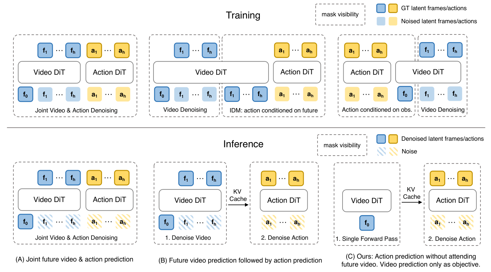
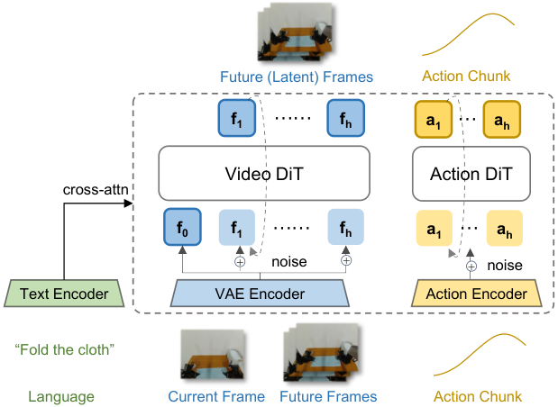
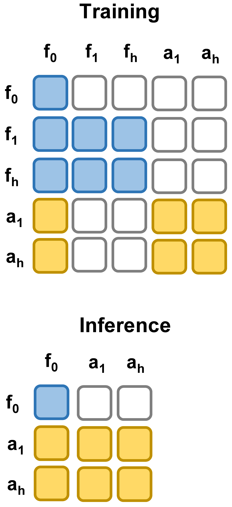
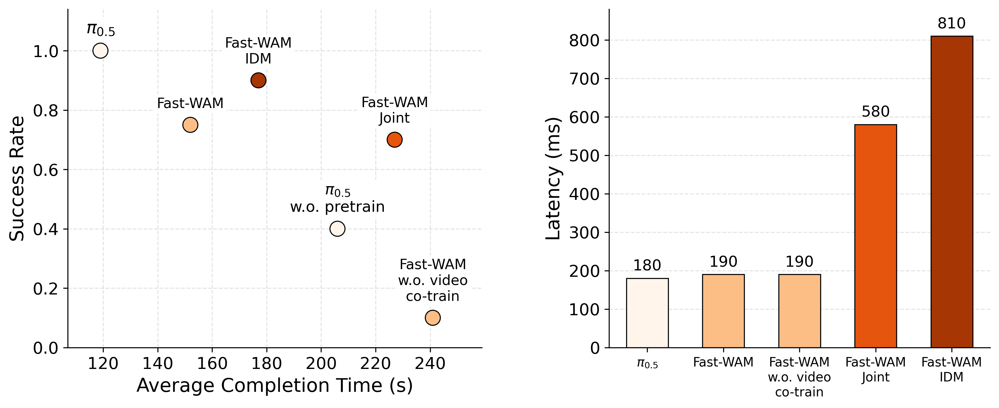

# Fast-WAM 阅读笔记

- 论文：Fast-WAM: Do World Action Models Need Test-time Future Imagination?
- 原文：https://arxiv.org/pdf/2603.16666
- 阅读版本：arXiv v2，2026-03-23
- 开始日期：2026-09-23
- 状态：初读；以下区分论文主张与待验证问题。

## 1. Problem Statement

> Do WAMs need to imagine future observations at test time, or do they benefit primarily from learning to model them during training?
>
> — [Fast-WAM, §1 Introduction](https://arxiv.org/html/2603.16666v2#S1)

**Do the benefits of WAMs come mainly from learning to predict videos during training, or from actually generating future observations at inference time?**

### Figure 1: Three WAM Paradigms

*Source: Tianyuan Yuan, Zibin Dong, Yicheng Liu, and Hang Zhao, Fast-WAM, arXiv:2603.16666v2, Figure 1. Reproduced without modification under [CC BY 4.0](https://creativecommons.org/licenses/by/4.0/). [Original figure and caption](https://arxiv.org/html/2603.16666v2#S1.F1).*

The top half shows training; the bottom half shows inference. Blue tokens represent video frame latents, and yellow tokens represent actions. $f_0$ is the current observation, $f_1, \ldots, f_h$ are future frames, and $a_1, \ldots, a_h$ form an action sequence. Dashed boxes indicate attention visibility.

| Paradigm | Training | Inference |
| --- | --- | --- |
| **A. Joint** | Jointly learn to denoise future video and actions; actions can access video tokens | Iteratively denoise video and actions together |
| **B. Video → Action / IDM** | Learn video prediction and action prediction conditioned on future video | Generate future video first, then generate actions conditioned on its representations |
| **C. Fast-WAM** | Retain the video prediction objective, but let the action branch access only the current observation, not future video | Encode the current observation through the video backbone once, cache its keys and values (KV), then denoise actions |

### Why Separate the Problem into Two Factors?

Existing WAMs often combine two factors:

1. **Training-time video modeling: learning to predict the future.** The video prediction loss may encourage the model to learn motion, interactions, and temporal structure, making its representation of the current observation more useful for action learning. The potential benefit comes from how training shapes the model's parameters and representations.
2. **Test-time future imagination: explicitly generating the future.** During execution, the model generates future video or its latents and uses them to predict actions. The potential benefit comes from the imagined future information available for that particular decision, at the cost of iterative video denoising latency.

When these factors always occur together, a high task success rate does not reveal which one contributes most. The authors therefore ask more than how to generate future observations faster: **How much action performance can be retained if video modeling supervision is preserved during training, but future generation is removed during execution?**

### The Authors' Hypothesis and Evaluation Strategy

**Hypothesis to test:** If most of the benefit comes from representations learned during training, encoding only the current observation at inference time may still produce sufficiently good actions. Explicit future generation may not be a necessary step to obtain those benefits.

To test this hypothesis, the paper constructs several controlled variants within a shared implementation framework (§3.3):

- **Fast-WAM vs. Joint / IDM:** Compare designs with and without future generation in terms of action performance and inference cost.
- **Fast-WAM vs. the variant without video co-training:** Keep the architecture and inference procedure unchanged while removing the video modeling objective, to examine the contribution of the training signal itself.

**Scope of interpretation:** These comparisons involve different training and information-flow designs; they do not simply toggle an inference option in the same trained model. Results should be interpreted within the paper's tasks, models, and training settings, and do not establish that all WAMs or planning tasks can dispense with future prediction. “Single Forward Pass” refers only to observation encoding by the video backbone; the action branch still requires iterative denoising.

### The Authors' Conclusion / Main Takeaway

**Within the tasks and settings studied, the main benefit of WAMs appears more likely to come from video modeling during training than from explicitly generating future observations at inference time.** The authors find that Fast-WAM remains competitive with Joint / IDM designs without generating future video, whereas removing the video co-training objective causes a larger performance drop. (Abstract, §1)

On RoboTwin, for example, the average success rates are **91.8%** for Fast-WAM, **90.6%** for Joint, and **91.3%** for IDM. Removing video co-training reduces the success rate to **83.8%**, a drop of **8.0 percentage points** from the full model. (Table 1) This comparison supports retaining the video training objective. The authors further interpret it as evidence that video modeling improves the internal representations used for action prediction.

**How to interpret this conclusion:** The idea that training produces more useful world representations is the authors' explanation of the experimental findings. The experiments do not directly measure or prove that the model understands physical laws, nor do they imply that future generation has no value in any task.

### Key Contributions

The introduction presents three contributions:

1. **Question: distinguish two sources of improvement.** Study video prediction supervision during training separately from future generation during inference, explicitly asking whether WAMs must imagine the future during execution.
2. **Method: introduce Fast-WAM.** Retain joint video and action training, and repurpose the pretrained video DiT as an observation encoder that runs once at inference time. Its representations support action denoising while avoiding iterative future video generation.
3. **Evidence: test design choices through controlled variants.** Compare Joint, IDM, and a variant without video co-training within a shared framework. Together with simulation and real-world robot experiments, these comparisons support the conclusion that the video training objective contributes substantially, while explicit future generation is not necessary for strong action performance in these settings.

The paper also reports **190 ms** inference latency and a speedup of over **4×** relative to the imagine-then-execute WAMs it compares against. Latency is measured on a single **NVIDIA RTX 5090D V2 32GB** GPU and should not be assumed to apply to other hardware. (Abstract, §4.1) “Without embodied pretraining” does not mean training from scratch: the model uses a pretrained **Wan2.2-5B** video backbone.

Sources: [Abstract and introduction](https://arxiv.org/html/2603.16666v2#S1), [experiments](https://arxiv.org/html/2603.16666v2#S4).

## 2. Methodology

### Figure 2: Model Architecture and Attention Masks

| (a) Fast-WAM model architecture | (b) Training and inference masks |
| :---: | :---: |
|  |  |

In panel (b), colored cells indicate permitted attention; rows are queries and columns are keys. Future-video tokens are present during training and removed at inference.

*Source: Tianyuan Yuan, Zibin Dong, Yicheng Liu, and Hang Zhao, Fast-WAM, arXiv:2603.16666v2, Figure 2. Panels reproduced without modification under [CC BY 4.0](https://creativecommons.org/licenses/by/4.0/). Architecture image from the [paper](https://arxiv.org/html/2603.16666v2#S3.F2); attention-mask image from the authors' [project page](https://yuantianyuan01.github.io/FastWAM/).*

### 2.1 Overall Training Process

**Fast-WAM jointly trains action generation and future-video prediction, using the current observation and language instruction as shared conditions. Both tasks use flow matching. Future-video prediction is an explicit auxiliary training task whose intended benefit is to improve the representations used for actions.**

1. **Prepare a demonstration segment.** The sample provides the current observation $o$, task instruction $l$, recorded future frames $v_{1:T}$, and ground-truth action chunk $a_{1:H}$. These future frames come from the demonstration data, not from model-generated rollouts.
2. **Encode visual and language inputs.** A pretrained video VAE maps the observations and future video into latents. The pretrained T5 encoder embeds the instruction, which is supplied through cross-attention. Video latents are organized into tokens for the video DiT; a frame need not correspond to a single token.
3. **Keep the observation clean and corrupt both prediction targets.** Add Gaussian noise to the future-video latents and to the action chunk. Do not add diffusion noise to the current-observation tokens. The two noisy inputs have different shapes: one represents video latents, the other robot actions.
4. **Run the video DiT and action expert with shared attention and a structured mask.** The architecture is a Mixture-of-Transformer (MoT): video tokens are processed by the video branch, and action tokens by the action expert. Each prediction branch can read the current-observation tokens, but actions cannot read future-video tokens.
5. **Predict velocity fields and optimize both losses.** At sampled noise levels, each branch predicts its flow-matching velocity target. The weighted sum of the action and video losses is backpropagated through the trainable computation graph. Training does not require running a complete noise-to-video generation trajectory for each loss evaluation.

**Attention visibility (rows read columns):**

| Query group | Current observation | Future video | Actions |
| --- | --- | --- | --- |
| Current observation | Yes | No | No |
| Future video | Yes | Yes | No |
| Actions | Yes | No | Yes |

All groups also receive language conditioning through cross-attention. Blocking observation tokens from reading future-video or action tokens prevents an indirect information leak into the action branch. Tokens within the future-video group and within the action group can attend bidirectionally; the token sequence is not generated one frame at a time during this training forward pass.

**Why can the video task help if actions cannot read future tokens?** The attention mask restricts forward information access, not gradient-based learning. Video and action prediction use the same observation context, and current/future video tokens use the video backbone. The video loss can shape shared trainable parameters and the observation representations that actions consume. This is a mechanism-based explanation; the ablations support the usefulness of video co-training but do not directly establish which physical properties are encoded.

### 2.2 Inference Process

1. **Encode the current observation and instruction.** Use the VAE and text encoder; no future frames are supplied.
2. **Run the video backbone once on clean observation tokens.** Retain its layer-wise keys and values as a KV cache for action generation. No future-video tokens or future-video noise are instantiated.
3. **Initialize an action chunk from Gaussian noise.** The initial noise has the same shape as the action chunk to be generated.
4. **Generate actions with 10 denoising steps.** The action expert repeatedly reads the cached observation features and language condition while updating the action state from noise toward data. This describes one action-chunk generation pass, not an outer autoregressive video rollout.

**“Single forward pass” applies to the video backbone, not to the complete policy.** Action generation remains iterative. The computation saved is future-video denoising; Fast-WAM also has no need to decode a predicted future video into pixels for action inference.

| Component | Training | Inference |
| --- | --- | --- |
| Current-observation tokens | Clean conditioning input | Clean conditioning input |
| Future-video tokens | Ground-truth VAE latents mixed with Gaussian noise | Absent |
| Action input | Ground-truth actions mixed with Gaussian noise | Initialized from Gaussian noise |
| Video task | Velocity prediction and video loss | No future-video generation |
| Action task | Velocity prediction and action loss | Iterative action generation |

Source: [§3.2, architecture and objectives](https://arxiv.org/html/2603.16666v2#S3.SS2), [§4.1, implementation details](https://arxiv.org/html/2603.16666v2#S4.SS1).

### 2.3 Formulation and Loss Functions

**Notation.** $o$: current observation; $l$: instruction; $a_{1:H}$: action chunk; $v_{1:T}$: future video. $H$ and $T$ index action/video horizons, whereas $t\in(0,1)$ below is a flow/noise time, not a frame index. We write $c_{\mathrm{obs}}$ for the VAE-level observation latents and $z_\theta(o,l)$ for the subsequent contextual representation from the video backbone; these are different stages of representation.

**Policy formulation (paper Eqs. 1–4).** A direct policy models:

$$
p(a_{1:H}\mid o,l).
$$

An imagine-then-execute formulation introduces future observations as an intermediate variable:

$$
p(a_{1:H}\mid o,l)
=\int p(v_{1:T}\mid o,l)\,
p(a_{1:H}\mid o,l,v_{1:T})\,dv_{1:T}.
$$

The integral marginalizes over possible futures; it does not prescribe explicitly enumerating every future in an implementation. Fast-WAM instead parameterizes the action distribution with the current-context representation:

$$
p_\theta(a_{1:H}\mid o,l)
=p_\theta(a_{1:H}\mid z_\theta(o,l)).
$$

$z_\theta(o,l)$ is shaped by future-video prediction training, but is not an explicit encoding of the current sample's ground-truth future frames. It may contain predictive cues about likely dynamics; it cannot directly read those future frames through the attention mask.

**Flow-matching path (Eq. 5).** For a clean target $y$, sample Gaussian noise and construct an interpolated input:

$$
\epsilon\sim\mathcal N(0,I),\qquad
 y_t=(1-t)y+t\epsilon.
$$

Thus $y_0=y$ is clean data and $y_1=\epsilon$ is noise. The path's derivative gives the target velocity:

$$
\frac{dy_t}{dt}=\epsilon-y.
$$

**Generic objective (Eq. 6).** The network predicts this velocity from the noisy input and conditioning:

$$
\mathcal L_{\mathrm{FM}}(y)
=\mathbb E_{y,\epsilon,t}
\left[\left\|f_\theta(y_t,t,o,l)-(\epsilon-y)\right\|_2^2\right].
$$

This is a velocity-regression loss, not a pixel-reconstruction loss. For video, the velocity describes motion through latent space, not optical flow or physical object velocity. Section 4.1 specifies a logit-normal noise-time schedule; the Gaussian distribution describes $\epsilon$, not $t$.

**Video objective (Eq. 8).** Let $z_{1:T}$ denote the future-video latents obtained from the recorded frames using the pretrained VAE. Set $y=z_{1:T}$:

$$
\widetilde z_t=(1-t)z_{1:T}+t\epsilon_v,
$$

$$
\mathcal L_{\mathrm{vid}}
=\mathbb E\left[
\left\|f_{\theta,v}(\widetilde z_t,t,o,l)
-(\epsilon_v-z_{1:T})\right\|_2^2
\right].
$$

The video network learns how noisy future latents should move along the data-to-noise path. To generate a video, one would integrate the learned field backward from noise at $t=1$ to data at $t=0$, then decode the resulting latents with the VAE. Fast-WAM omits that video-generation procedure at inference.

**Action objective (Eq. 7).** Apply the same construction to $y=a_{1:H}$:

$$
\widetilde a_t=(1-t)a_{1:H}+t\epsilon_a,
$$

$$
\mathcal L_{\mathrm{act}}
=\mathbb E\left[
\left\|f_{\theta,a}(\widetilde a_t,t,o,l)
-(\epsilon_a-a_{1:H})\right\|_2^2
\right].
$$

The subscripts $v$ and $a$ here distinguish the two branches for clarity. Both noises are Gaussian with shapes matching their targets. The method text does not specify whether the noise times for the two branches are sampled independently or shared.

**Joint loss (Eq. 9):**

$$
\boxed{\mathcal L=\mathcal L_{\mathrm{act}}+\lambda\mathcal L_{\mathrm{vid}}}
$$

$\lambda$ balances the two objectives; no numerical value is given in the paper's method and implementation-detail sections. Video prediction is explicitly supervised during training, while its benefit for action representations is indirect. Adding noise constructs the generative learning task; the attention mask, rather than noise itself, prevents future-information leakage.

**Generation direction.** Since the target velocity points from data to noise, generation follows the field in decreasing $t$. A simple Euler illustration is:

$$
y_{t-\Delta t}\approx y_t-\Delta t\,f_\theta(y_t,t,o,l).
$$

This equation illustrates the sign and direction; it is not a claim about the exact numerical solver used by the authors. Fast-WAM uses this generative principle for actions at inference, starting from $\epsilon_a$.

Source: [§3.1–3.2, Eqs. 1–9](https://arxiv.org/html/2603.16666v2#S3.SS1).

### 2.4 Pretrained Components and the Specific VAE

The paper explicitly states that Fast-WAM reuses the pretrained **Wan2.2-5B video DiT, text encoder, and video VAE**. It adds an action expert of approximately **1B parameters**, with hidden dimension **1024**, giving a reported total model size of approximately **6B**. The action horizon is **32**. “Without embodied pretraining” therefore does not mean without pretrained weights.

| Component | Role | Identification |
| --- | --- | --- |
| Video DiT | Shared video modeling backbone; observation encoder at inference | Wan2.2-5B, explicitly named in Fast-WAM |
| Video VAE | Encode visual inputs and future targets into video latents | Pretrained VAE reused from Wan2.2-5B |
| Text encoder | Encode instructions for cross-attention | Pretrained T5 encoder reused from Wan2.2 |
| Action expert DiT | Predict action velocity fields and generate action chunks | Added by Fast-WAM; approximately 1B parameters |

**Which VAE checkpoint?** The corresponding official **Wan-AI/Wan2.2-TI2V-5B** release uses **Wan2.2-VAE**, with checkpoint filename **`Wan2.2_VAE.pth`**. Its official configuration specifies VAE stride **`(4, 16, 16)` in time, height, and width**: 4× temporal compression and 16× compression along each spatial dimension. This is the official upstream component associated with the 5B backbone; the Fast-WAM paper itself does not give the checkpoint filename or an exact checkpoint revision.

The same upstream configuration identifies the text encoder as **UMT5-XXL**, using **`models_t5_umt5-xxl-enc-bf16.pth`** and tokenizer **`google/umt5-xxl`**. These checkpoint details supplement the paper's shorter “T5” description; they are not independently verified Fast-WAM training configuration values.

**Pretrained versus frozen:** The paper establishes reuse of pretrained components, but its method and implementation-detail sections do not explicitly specify whether the VAE and text encoder remain frozen. Do not infer their training status solely from the word “pretrained.” The flow-matching losses above are the policy/video-modeling objectives, not a specification for pretraining the VAE itself.

Sources: [Fast-WAM §3.2 and §4.1](https://arxiv.org/html/2603.16666v2#S3.SS2), [official Wan2.2-TI2V-5B model card](https://huggingface.co/Wan-AI/Wan2.2-TI2V-5B), [official 5B configuration](https://github.com/Wan-Video/Wan2.2/blob/main/wan/configs/wan_ti2v_5B.py).

## 3. Results

### 3.1 Benchmarks and Evaluation Data

The paper evaluates on two simulation benchmarks and one real-world task. The training data below are the task-training setup reported by Fast-WAM, not the complete pretraining datasets of every external baseline.

| Benchmark | Task coverage and training data | Training / evaluation protocol | Metrics |
| --- | --- | --- | --- |
| **LIBERO** | Spatial, Object, Goal, and Long suites; 10 tasks and 500 demonstrations per suite (40 tasks and 2,000 demonstrations in total) | Authors' models trained for 20k steps; 2,000 evaluation trials across 40 tasks | Success rate per suite and average |
| **RoboTwin 2.0** | Bimanual manipulation; paper describes over 50 tasks; 2,500 clean-scene and 25,000 randomized-scene demonstrations | Authors' models trained for 30k steps; 100 trials per task in clean and randomized settings | Clean, randomized, and average success rates |
| **Real-world towel folding** | Galaxea R1 Lite; 60 hours of teleoperated demonstrations | Models trained for 30k steps; evaluation trial count is not specified in the experiment-setup text | Success rate, average completion time, and inference latency |

Latency is measured on a single NVIDIA RTX 5090D V2 32GB GPU. Task completion time (seconds to fold a towel) and inference latency (milliseconds to generate an action chunk) are different metrics.

Source: [§4.1–4.2](https://arxiv.org/html/2603.16666v2#S4.SS1).

### 3.2 Baselines and Where They Are Compared

The study has two comparison levels: external methods establish competitiveness, while variants built within the Fast-WAM framework address the central research question more directly.

| Method | Role in the comparison | Benchmarks reported in this paper | Embodied pretraining |
| --- | --- | --- | --- |
| **OpenVLA** | VLA baseline mapping visual/language context to actions | LIBERO | Yes |
| **$\pi_0$** | VLA flow-model baseline | LIBERO, RoboTwin | Yes |
| **$\pi_{0.5}$** | Strong VLA baseline | LIBERO, RoboTwin, real-world towel folding | Yes; a separate version without pretraining is also compared on towel folding |
| **Motus** | WAM baseline; joint video/action modeling family | LIBERO, RoboTwin | Yes; an additional “from WAN2.2” version without embodied pretraining is reported on RoboTwin |
| **LingBot-VA** | Causal WAM baseline; video-then-action family | LIBERO, RoboTwin | Yes; an additional “from WAN2.2” version without embodied pretraining is reported only for RoboTwin Clean |
| **Fast-WAM-Joint** | Controlled variant jointly denoising future video and actions | All three settings | No |
| **Fast-WAM-IDM** | Controlled variant generating future video before actions | All three settings | No |
| **Fast-WAM without video co-training** | Same architecture and inference procedure, but video modeling objective removed | All three settings | No |
| **Fast-WAM** | Video co-training retained; future generation omitted at inference | All three settings | No |

“Embodied pretraining: No” does not mean no pretrained backbone or no robot demonstrations. Fast-WAM starts from pretrained Wan2.2 weights and trains on the task demonstrations above. External baseline differences may also reflect architecture, data, and training recipes; their score gaps do not isolate one causal factor.

Sources: [§3.3](https://arxiv.org/html/2603.16666v2#S3.SS3), [Tables 1–2 and §4.3](https://arxiv.org/html/2603.16666v2#S4.SS3).

### 3.3 Simulation Results: Where Does Fast-WAM Improve?

All scores are success rates in percent. **Differences are percentage points (pp), calculated from the displayed table values.** Positive differences favor Fast-WAM. Rounded averages are reproduced as reported.

| External baseline | Embodied PT | RoboTwin average | Fast-WAM minus baseline | LIBERO average | Fast-WAM minus baseline |
| --- | --- | ---: | ---: | ---: | ---: |
| OpenVLA | Yes | — | — | 76.5 | +21.1 pp |
| $\pi_0$ | Yes | 62.2 | +29.6 pp | 94.1 | +3.5 pp |
| $\pi_{0.5}$ | Yes | 79.8 | +12.0 pp | 96.9 | +0.7 pp |
| Motus | Yes | 87.8 | +4.0 pp | 97.7 | −0.1 pp |
| Motus from WAN2.2 | No | 77.3 | +14.5 pp | — | — |
| LingBot-VA | Yes | 92.2 | −0.4 pp | 98.5 | −0.9 pp |
| **Fast-WAM** | **No** | **91.8** | — | **97.6** | — |

**RoboTwin:** Fast-WAM substantially exceeds several listed baselines and approaches pretrained LingBot-VA. Its clean/randomized scores are 91.88/91.78, showing similar performance across those two evaluated conditions.

**Important missing-data caveat:** LingBot-VA from WAN2.2 reports Clean = 80.60 and no randomized score. Although Table 1 places 80.6 in its Average column, it is not a complete clean/randomized average. The matched comparison is **91.88 − 80.60 = +11.28 pp on Clean**, not 91.8 − 80.6 on a common average.

**LIBERO:** Fast-WAM exceeds the listed VLA baselines on average but does not exceed Motus or LingBot-VA. Its suite scores are Spatial 98.2, Object 100.0, Goal 97.0, and Long 95.2. The appropriate claim is competitive overall performance, not best performance on every benchmark.

Source: [Tables 1–2](https://arxiv.org/html/2603.16666v2#S4.SS3).

### 3.4 Controlled Ablations: The Main Evidence

| Variant | Video co-training | Generates future video at inference | RoboTwin average | LIBERO average |
| --- | --- | --- | ---: | ---: |
| **Fast-WAM** | Yes | No | **91.8** | **97.6** |
| Joint | Yes | Yes, jointly with actions | 90.6 | 98.5 |
| IDM | Yes | Yes, before actions | 91.3 | 98.0 |
| Without video co-training | No | No | 83.8 | 93.5 |

- **Benefit associated with video co-training:** Fast-WAM exceeds its no-video-co-training ablation by **8.0 pp on RoboTwin** and **4.1 pp on LIBERO**.
- **Difference associated with the future-generation designs:** On RoboTwin, Fast-WAM exceeds Joint/IDM by **1.2/0.5 pp**; on LIBERO, it trails them by **0.9/0.4 pp**.
- **Where the LIBERO ablation hurts most:** Removing video co-training lowers Spatial by **9.0 pp** and Long by **5.2 pp**, versus Object by 0.8 pp and Goal by 1.6 pp.

The gap from removing video co-training is larger than the gap between the three designs with video co-training. This supports the authors' central interpretation. However, Tables 1–2 do not provide confidence intervals or training-seed variability, so small differences should not be presented as statistically established superiority or equivalence.

Source: [§4.3.2](https://arxiv.org/html/2603.16666v2#S4.SS3.SSS2).

### 3.5 Real-World Results and Speed

*Source: Tianyuan Yuan, Zibin Dong, Yicheng Liu, and Hang Zhao, Fast-WAM, Figure 4, reproduced without modification from the authors' [project page](https://yuantianyuan01.github.io/FastWAM/). Paper licensed under [CC BY 4.0](https://creativecommons.org/licenses/by/4.0/).*

Success rates and completion times below are approximate readings of Figure 4's scatter plot, not a numeric table supplied by the authors. Latencies are explicitly labeled on the bar chart. The text explicitly reports 10% success for the no-video-co-training ablation.

| Method | Approx. success rate | Approx. completion time | Labeled inference latency |
| --- | ---: | ---: | ---: |
| Pretrained $\pi_{0.5}$ | 100% | 119 s | 180 ms |
| $\pi_{0.5}$ without pretraining | 40% | 206 s | Not separately labeled |
| **Fast-WAM** | **75%** | **152 s** | **190 ms** |
| Fast-WAM-Joint | 70% | 227 s | 580 ms |
| Fast-WAM-IDM | 90% | 177 s | 810 ms |
| Fast-WAM without video co-training | 10% | 241 s | 190 ms |

**Quality trade-off:** Pretrained $\pi_{0.5}$ remains the strongest method on this real-world task. IDM has a higher success rate than Fast-WAM (approximately 90% vs. 75%), while Fast-WAM completes the task faster. Thus the real-world results show a meaningful quality/speed trade-off, not identical success rates across all variants.

**Video co-training benefit:** Fast-WAM improves success by approximately **65 pp** over its no-video-co-training ablation, while both have the same 190 ms inference latency. This is particularly clear evidence that the training objective matters beyond simply making inference faster.

**Inference speed:** Calculated from Figure 4:

- Versus Joint: **580 / 190 ≈ 3.05× speedup**, or **67.2% lower latency**.
- Versus IDM: **810 / 190 ≈ 4.26× speedup**, or **76.5% lower latency**.
- Versus pretrained $\pi_{0.5}$: Fast-WAM is **10 ms slower** (190 vs. 180 ms).

The headline “over 4× faster” applies to the IDM comparison shown here; the Joint comparison is approximately 3×. These inference speedups should not be confused with task-completion speedups. Completion-time averages also require care when success rates differ, particularly because the experiment text does not specify how failed trials enter that average.

Source: [Figure 4 and §4.3.3](https://arxiv.org/html/2603.16666v2#S4.SS3.SSS3).

### 3.6 Discussion: How to Interpret the Results

**Why does pretrained $\pi_{0.5}$ perform best in Figure 4?**

The paper explicitly acknowledges that pretrained $\pi_{0.5}$ is the strongest method on real-world towel folding. It achieves approximately 100% success with a 119 s average completion time, versus approximately 75% and 152 s for Fast-WAM. Its labeled inference latency is also slightly lower: 180 ms versus 190 ms.

An important difference is access to **embodied pretraining**. Fast-WAM starts from a pretrained video backbone but does not use embodied pretraining. Broad robot-control experience could help $\pi_{0.5}$ select effective actions and handle deformable-object manipulation. This is a plausible interpretation, not an isolated causal finding: the comparison also differs in architecture and training recipe.

**Embodied pretraining is not the same as pretraining on the target task.** The 60 hours of towel-folding demonstrations are the task-training data described by this study. Figure 4 does not establish that pretrained $\pi_{0.5}$ wins because it previously saw those target-task examples, nor that pretrained VLAs always outperform WAMs.

**Is Fast-WAM both better and faster than $\pi_{0.5}$ without pretraining?**

It has higher reported success and shorter average task completion time, but faster inference is not established:

| Metric | Fast-WAM | $\pi_{0.5}$ without pretraining | Supported interpretation |
| --- | ---: | ---: | --- |
| Success rate, approximately | 75% | 40% | Fast-WAM succeeds more often |
| Average completion time, approximately | 152 s | 206 s | Fast-WAM has a shorter reported task duration |
| Inference latency | 190 ms | Not separately labeled | No direct latency comparison is available for this baseline variant |

Figure 4's 180 ms bar is labeled $\pi_{0.5}$; it does not separately identify the version without pretraining. Consequently, “faster” should refer to task completion in this comparison, not an established inference-speed advantage.

**Why can a policy take longer to finish even if each inference is fast?**

Task duration includes physical execution, waiting for computation, and potentially retries or corrective movements. An inaccurate grasp or fold can require another attempt, so a fast action predictor can still produce a slow overall behavior. Less effective actions and more corrections are plausible explanations for the unpretrained baseline's longer completion time. The paper does not count these behaviors for $\pi_{0.5}$ or identify them as the measured cause of the gap.

The experiment text also does not specify how failures or timeouts enter the completion-time average. Since success rates differ substantially, the timing metric should not be interpreted without that qualification.

**What do Fast-WAM, Joint, and IDM trade off?**

All three retain video co-training. Fast-WAM predicts actions without reading future-video tokens; Joint denoises future video and actions together; IDM generates future video first and then conditions action generation on it.

On the real-world task, Figure 4 shows:

- **IDM vs. Fast-WAM:** Approximately 90% vs. 75% success, but 810 vs. 190 ms inference latency and approximately 177 vs. 152 s completion time. IDM offers higher observed success at greater computational cost and longer task duration.
- **Joint vs. Fast-WAM:** Approximately 70% vs. 75% success, 580 vs. 190 ms inference latency, and approximately 227 vs. 152 s completion time. Fast-WAM is better on all three displayed metrics for this task, but the small success-rate difference is not accompanied by confidence intervals.

This does not establish that Joint is generally a worse policy or that IDM always has the highest success rate.

**Do Table 2 and Figure 4 contradict each other?**

No: they evaluate different task distributions using different task-training data.

| Variant | Table 2: LIBERO average success | Figure 4: real-world towel-folding success, approximately |
| --- | ---: | ---: |
| Fast-WAM | 97.6% | 75% |
| Joint | **98.5%** | 70% |
| IDM | 98.0% | **90%** |

Table 2 averages 40 simulated tasks across four LIBERO suites. Figure 4 studies a real robot folding a deformable towel. The ranking therefore changes from **Joint > IDM > Fast-WAM** on LIBERO to **IDM > Fast-WAM > Joint** on towel folding. These are not repeated measurements of the same trained policy on the same task, and a ranking from one setting should not be generalized to all settings.

The approximately 15 pp success gap between IDM and Fast-WAM on towel folding deserves attention: explicit future generation may still be useful for some tasks. The study does not isolate why the ranking changes.

Sources: [§4.2, evaluation setup](https://arxiv.org/html/2603.16666v2#S4.SS2), [Table 2 and §4.3](https://arxiv.org/html/2603.16666v2#S4.SS3), [Figure 4 and §4.3.3](https://arxiv.org/html/2603.16666v2#S4.SS3.SSS3). Scatter-plot values above are approximate readings; bar-chart latencies are explicitly labeled.

### 3.7 Overall Takeaway

**Fast-WAM offers a strong balance of action performance and inference cost, rather than universally maximizing success rate.** The most consistent finding across evaluations is the substantial degradation when video co-training is removed. The relative success of Fast-WAM, Joint, and IDM depends on the task: future generation brings limited differences on the simulation averages but IDM retains an appreciable observed success advantage on towel folding. Pretrained $\pi_{0.5}$ remains strongest on that real-world task. Together, these results support the value of video modeling during training and the efficiency of omitting future generation at inference, without proving that future generation is universally unnecessary.
